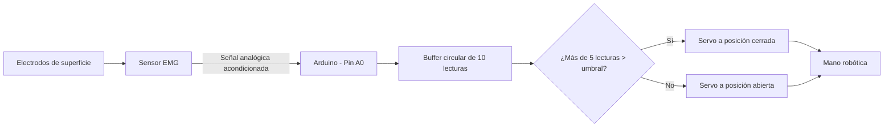

# Mano robótica controlada mediante Arduino y sensor EMG

Sistema de mano robótica que traduce señales musculares en movimiento: un sensor EMG capta la señal a través de electrodos de superficie, un algoritmo propio en Arduino la procesa mediante detección de umbral, y un servomotor reproduce el gesto de apertura y cierre sobre un modelo mecánico de mano adaptado para este proyecto.

Proyecto desarrollado en la Universidad de Ingeniería y Tecnología (UTEC) como parte del curso Fundamentos de Biofísica.

## Descripción general

El proyecto integra electrónica, programación embebida y adaptación mecánica para construir un prototipo funcional de mano robótica accionada por señales electromiográficas (EMG). Un sensor EMG capta la actividad eléctrica del músculo del antebrazo mediante electrodos de superficie desechables. Esa señal es leída por un Arduino, que aplica un algoritmo de detección de umbral con suavizado por ventana deslizante para decidir si el músculo está activo o en reposo, y en función de eso controla un servomotor que abre o cierra la mano.

El trabajo de este proyecto consistió en la conexión e integración del sensor EMG con el Arduino, el desarrollo completo del algoritmo de procesamiento de señal, y la adaptación mecánica del modelo de la mano para el ensamblaje del sistema.

## Objetivos

El objetivo general es demostrar la viabilidad de un sistema de bajo costo que traduzca señales musculares en movimiento mecánico controlado, aplicable como base conceptual para prótesis mioeléctricas.

Como objetivos específicos, el proyecto busca captar y digitalizar la señal EMG de un músculo del antebrazo mediante electrodos de superficie, procesar esa señal con un algoritmo de detección de umbral que sea robusto frente al ruido de la señal cruda, y accionar un actuador mecánico (servomotor) que reproduzca el movimiento de cierre y apertura de una mano robótica en respuesta a la contracción muscular detectada.

## Materiales y componentes

- Arduino (placa compatible, según el pin `SERVO_PIN` y `EMG_PIN` definidos en el código)
- Sensor de señal muscular EMG, con salida digital y conexión mediante jack de 3.5 mm para almohadilla biomédica. Voltaje de funcionamiento de 3.5 a 5 VDC. Incluye la placa del sensor, un cable EMG y tres electrodos de superficie desechables. El módulo integra internamente su propio circuito de acondicionamiento de señal (amplificación por instrumentación, filtrado y rectificación); esa etapa forma parte del sensor comercial y no fue diseñada en este proyecto.
- Electrodos de superficie desechables, para la captación de la señal sobre el músculo
- Servomotor, conectado al pin digital 3 de Arduino
- Modelo mecánico de mano robótica, adaptado a partir de piezas de la librería de partes del proyecto de código abierto [InMoov](https://inmoov.fr/inmoov-stl-parts-viewer/).

## Arquitectura del sistema

La señal sigue un flujo lineal desde la captación hasta el movimiento del actuador. Los electrodos de superficie, colocados sobre el músculo del antebrazo, captan la actividad eléctrica muscular y la entregan al sensor EMG a través del conector de 3.5 mm. El sensor acondiciona internamente esa señal (amplificación, filtrado y rectificación) y entrega una salida analógica proporcional a la intensidad de la contracción muscular. Esa salida se conecta al pin analógico A0 del Arduino, que la muestrea cada 20 milisegundos.

El Arduino mantiene un buffer circular con las últimas 10 lecturas y evalúa, en cada ciclo, cuántas de esas lecturas superan un umbral fijo. Si más de la mitad de las lecturas recientes superan el umbral, el Arduino interpreta que el músculo está contraído y mueve el servomotor a la posición correspondiente a la mano cerrada; en caso contrario, lo mueve a la posición de mano abierta. Este mecanismo de votación por mayoría sobre una ventana deslizante reduce la probabilidad de que una sola lectura ruidosa dispare un movimiento incorrecto.

## Diagrama de funcionamiento

## Instalación

Para replicar este proyecto se requiere una placa Arduino, el sensor EMG con sus electrodos, un servomotor, y el modelo mecánico de mano ya ensamblado.

Conecta la salida analógica del sensor EMG al pin A0 del Arduino, y la señal del servomotor al pin digital 3. Alimenta el sensor EMG según su voltaje de funcionamiento (3.5 a 5 VDC) y coloca los electrodos de superficie sobre el músculo del antebrazo que se usará para generar la señal.

Instala el Arduino IDE si no lo tienes, y abre el archivo `firmware/mano_robotica_emg.ino` desde este repositorio. El proyecto usa la librería `Servo.h`, que viene incluida por defecto en el Arduino IDE, por lo que no es necesario instalar dependencias adicionales. Selecciona la placa y el puerto correspondientes en el IDE, y carga el programa.

## Uso

Con el circuito conectado y el código cargado, abre el Monitor Serial del Arduino IDE a 9600 baudios para observar en tiempo real el valor leído del sensor y la cantidad de lecturas que superan el umbral. Al contraer el músculo donde están colocados los electrodos, la mano robótica debería cerrarse; al relajarlo, debería volver a la posición abierta.

Si el sistema no responde como se espera, revisa la colocación de los electrodos (el contacto con la piel debe ser firme y limpio) y, de ser necesario, ajusta el valor de `THRESHOLD` en el código según la intensidad de la señal muscular de cada persona, ya que este puede variar entre distintos usuarios.

## Resultados esperados

El sistema debería mostrar una transición clara y estable entre la posición abierta y cerrada de la mano en respuesta a la contracción voluntaria del músculo monitoreado, con una respuesta perceptible en el orden de los 200 milisegundos (10 muestras a 20 ms cada una), y sin activaciones falsas provocadas por ruido eléctrico de baja intensidad, gracias al filtro de mayoría sobre la ventana deslizante.

## Futuras mejoras

Entre las mejoras posibles para este proyecto se encuentran calibrar automáticamente el umbral de activación al inicio de cada sesión, en lugar de usar un valor fijo en el código, y agregar más de un canal EMG para poder controlar dedos de forma independiente en lugar de un movimiento único de apertura y cierre. También sería valioso explorar técnicas de procesamiento de señal más avanzadas (por ejemplo, análisis de la envolvente RMS) y evaluar el uso de comunicación inalámbrica entre el sensor y el sistema de control para mayor portabilidad.

## Evidencias

En la carpeta `docs/` se encuentra el diagrama del circuito interno del sensor EMG utilizado, y en la carpeta `media/` se encuentran una fotografía del ensamblaje final y un video de demostración del sistema en funcionamiento.

## Autor

Fernando Alonso Reyes Vargas, estudiante de Bioingeniería en la Universidad de Ingeniería y Tecnología (UTEC), Lima, Perú.

## Licencia

Este proyecto se distribuye bajo la licencia MIT (ver archivo `LICENSE`). El modelo 3D de la mano adaptado proviene del proyecto InMoov y conserva las condiciones de la licencia original de esa fuente.
